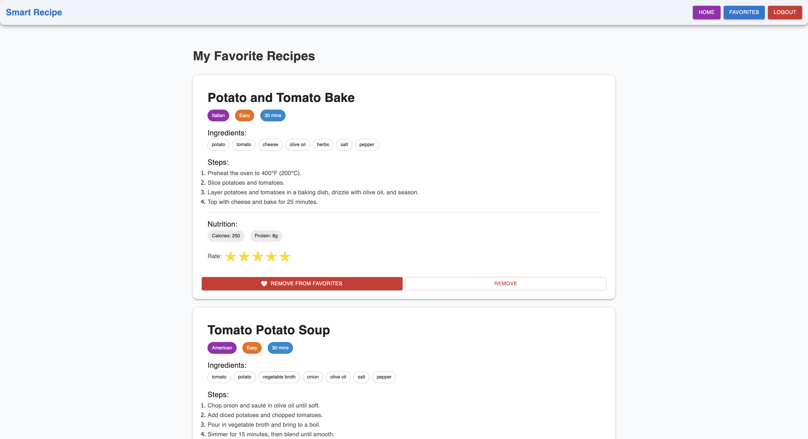

Perfect 👍 Since your backend also uses MongoDB for storing favorites/ratings and Google Vision API for image-based ingredient recognition, we’ll extend your .env setup and README accordingly.

Here’s your final, polished GitHub README (with MongoDB and Google Vision integration added) — completely deployment-ready and professional.

🍳 Smart Recipe Generator

The Smart Recipe Generator is a full-stack web application that suggests personalized recipes based on user-provided ingredients, preferences, and dietary restrictions. Users can input ingredients manually or upload images for automatic ingredient recognition. The system utilizes OpenAI’s API to generate recipe suggestions, nutritional information, and substitution recommendations, while Google Vision API identifies ingredients from uploaded images.

🖥️ Tech Overview

Frontend: React.js (deployed on Vercel)

Backend: Node.js + Express (deployed on Render)

Database: MongoDB Atlas (for favorites, ratings, and user data)

AI Services:

OpenAI API — for recipe generation and nutrition details

Google Vision API — for image-based ingredient recognition

UI Library: Material UI for a clean, responsive, and user-friendly interface

🌟 Key Features

🧠 Ingredient recognition from text or uploaded images (Google Vision API)

🍽️ AI-generated recipes with nutritional info and substitutions (OpenAI API)

⚙️ Filters for difficulty, cooking time, and dietary preferences

⭐ Favorites page to save and rate recipes

⏳ Loading states and error handling for improved UX

📱 Mobile-responsive design for seamless device compatibility

🧩 Approach

Ingredient Input: Users can type ingredients or upload an image.

Image Processing: The Google Vision API extracts and classifies ingredients.

AI Integration: The OpenAI API generates personalized recipes, nutritional details, and substitutions.

Recipe Display: Recipes are shown dynamically, filtered by diet, time, or difficulty.

Data Persistence: User favorites and ratings are stored in MongoDB Atlas for future access.

⚙️ Architecture

The frontend communicates with the hosted backend API, which handles user requests, processes images and ingredients, and interacts with OpenAI and Google Vision APIs.
This design ensures scalability, modularity, and smooth real-time performance.

Deployment:

Frontend: Vercel

Backend: Render

📸 Preview
Feature	Screenshot
🠠Home Page (Ingredient Input)	 |  |

🳠Recipe Results Page	|  |

⭐ Favorites Page	|  |

📱 Mobile View	|  |

(Replace placeholders with actual screenshots.)

🛠️ Setup Instructions
🔹 Prerequisites

Node.js
 (v16 or later)

npm
 or yarn

OpenAI API key

Google Vision API key (JSON file from Google Cloud Console)

MongoDB Atlas URI

🔹 Clone the Repository
git clone https://github.com/<your-username>/smart-recipe-generator.git
cd smart-recipe-generator

🔹 Backend Setup
cd backend
npm install

Create a .env file inside the backend folder and add:

OPENAI_API_KEY=your_openai_api_key_here
GOOGLE_VISION_API_KEY=your_google_vision_api_key_here
MONGODB_URI=your_mongodb_connection_uri
PORT=5000

Then start the backend server:

npm start

🔹 Frontend Setup
cd ../frontend
npm install
npm run dev

The app will be available at http://localhost:5173 (or as shown in your terminal).
